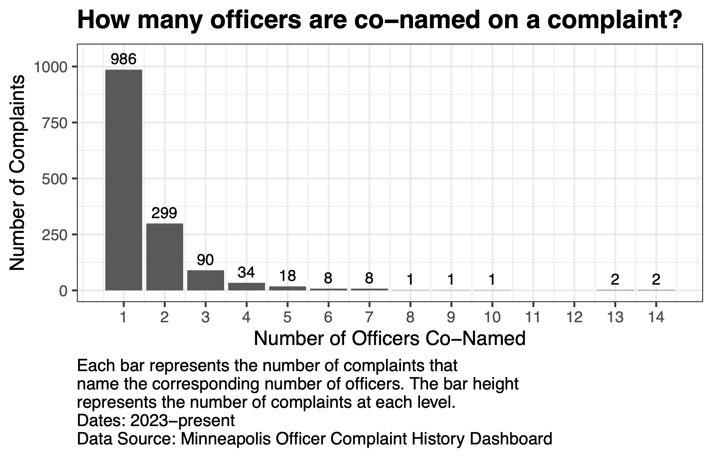
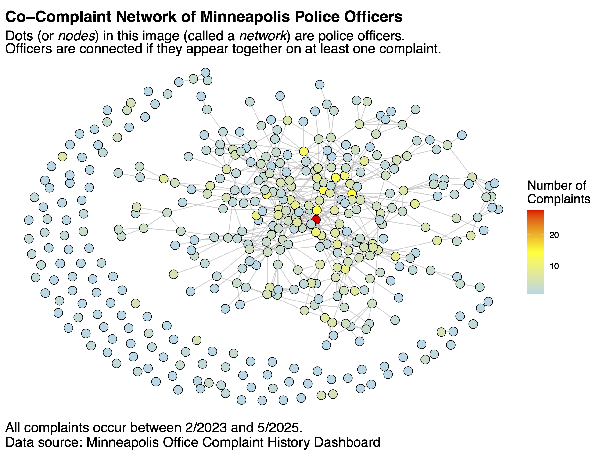
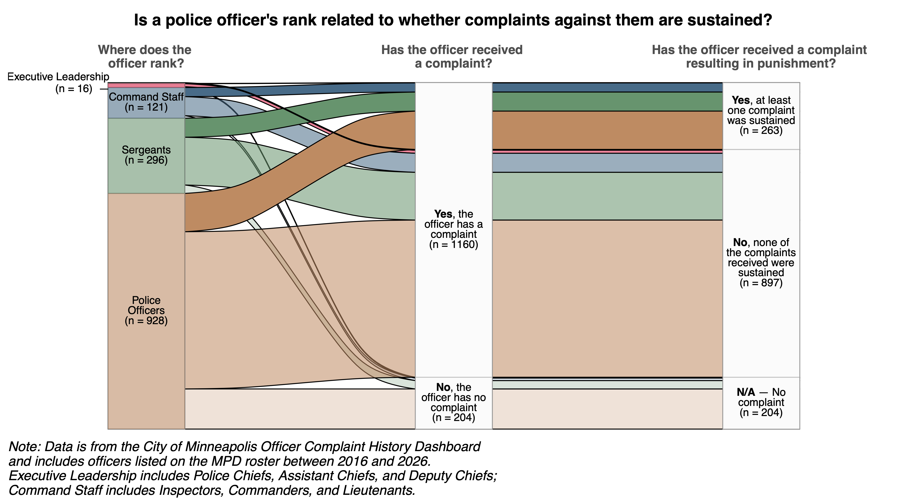
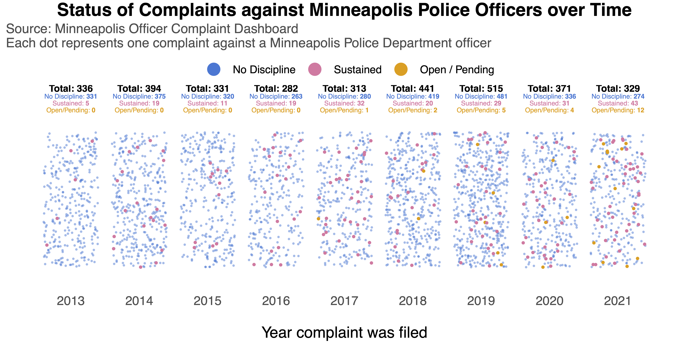
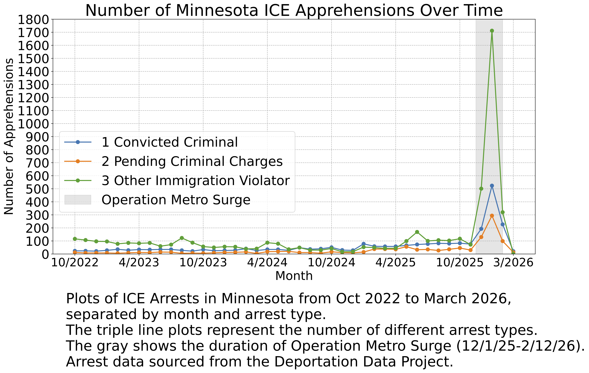
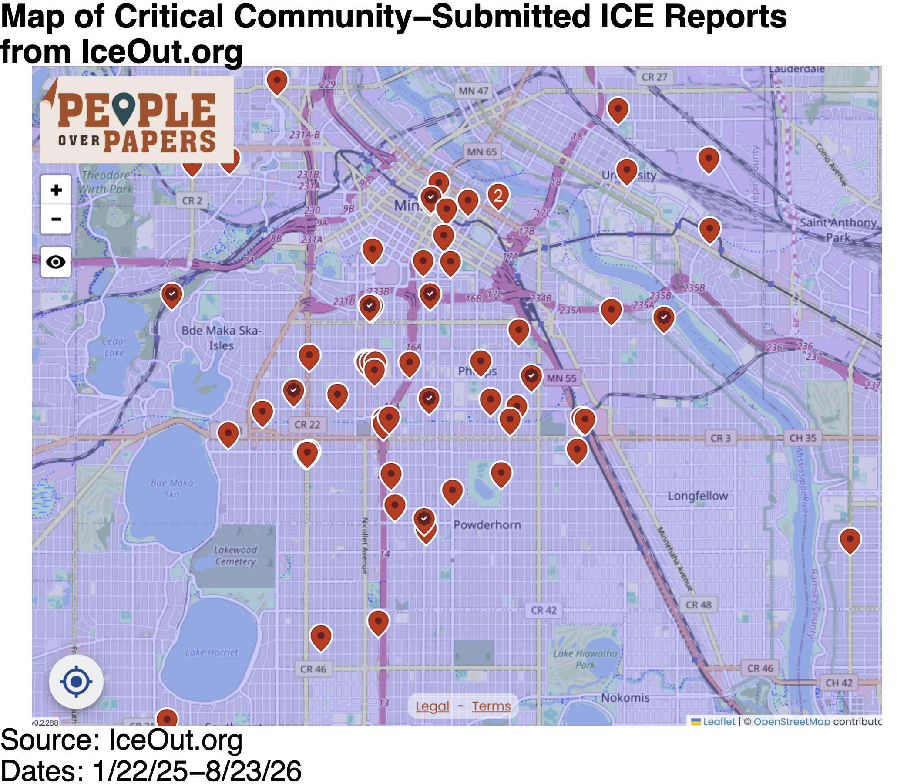
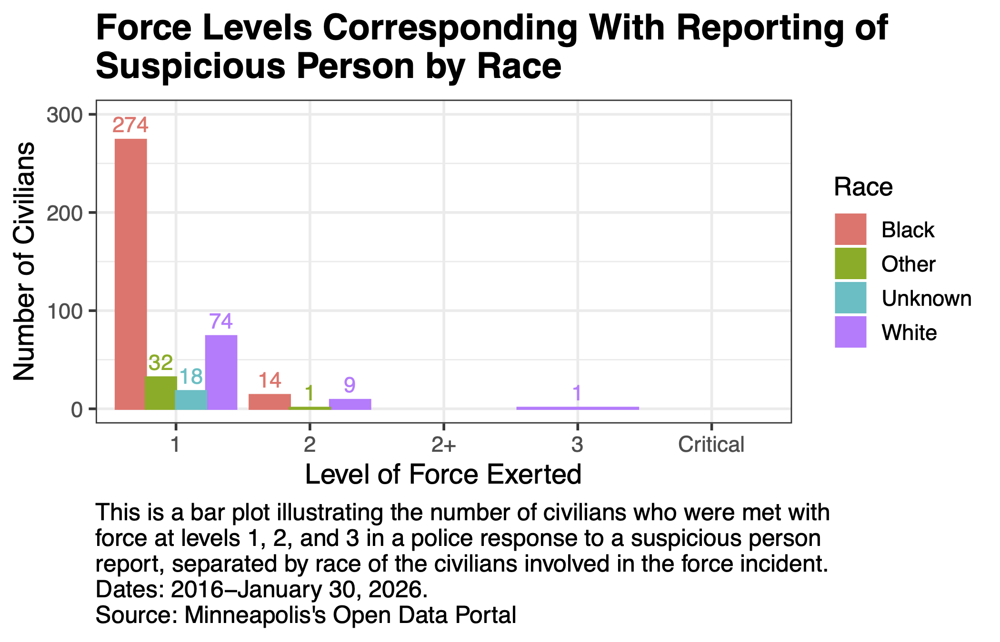
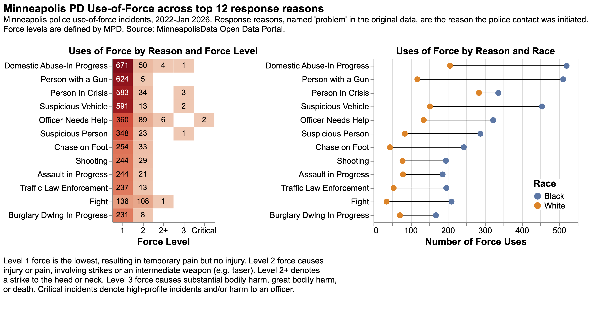
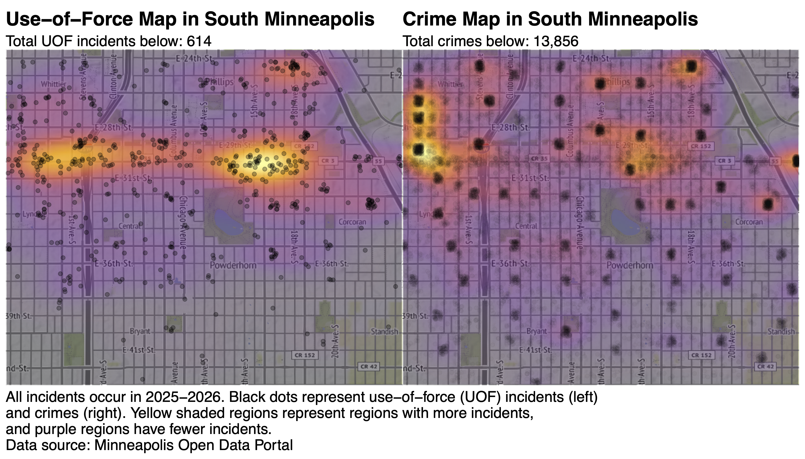

# Community Meeting

At the end of August 2026, we held an in-person meeting with our community partner, the Reinvestigation Workgroup (RWG), at the University of Minnesota's Urban Research and Outreach-Engagement Center (UROC). RWG is a Minnesota-based volunteer organization that investigates cases involving police violence, and together we collaborate on data projects driven by their questions relating to police accountability. During the meeting, we shared progress on our work on [comparative co-complaint networks](https://dspace-qside.github.io/posts/asa-poster/), and introduced new data sources that could be of interest in future analyses. We brainstormed new questions and ideas for data projects utilizing [use-of-force data](https://opendata.minneapolismn.gov/datasets/cityoflakes::police-use-of-force/about), [police officer complaint data](https://data.minneapolismn.gov/pages/officer-complaint-history-dashboard~18ae6f4b5f9b49e6bc37833c2b7a21f2), and data from the [Board of Peace Officers Standards and Training (POST)](https://mnitservices.my.site.com/POSTLicenseSearch/s/). 

We concluded the meeting with several courses of action, informed by rich insights from our community partners. For example, we plan to explore updating our network analysis with newly acquired POST data that includes tenure duration and departments, potentially providing insights into the movement of officers throughout Minnesota. Additionally, we may request enhanced officer training data to help us understand the relationships, if any, between officer training and complaints. Fruitful conversations on these topics also informed our later discussions during a data walk event in South Minneapolis.

# Data Walk

A data walk is typically a public event involving collaborative interpretation of data visualizations with community members. Its intended participants are the people who are most impacted by and/or represented in the data. Community members need not have any background in data science or the ongoing work of our group. The graphics presented are intended to provoke thoughtful reflection, curiosity, and conversation. These events present a unique opportunity to collaborate with community members and to drive new insight through a community-based and participatory research framework. 

Transmission, a critical and creative social lab facilitated by Confluence Studio: An East Lake Studio for Community Design, hosted the data walk. Attendees were encouraged to reflect on the data visualizations. We then gathered for discussion and reactions to the visualizations and the topics they covered. DSPACE presented the following visualizations at the event, with an open-ended caption to motivate discussion and input from the audience. The visualizations comprised complaints, use-of-force, and ICE data. 

**What do you see, notice, and wonder about these graphics?**

## Complaint Graphics

::: {.pt-3}
{width="60%" fig-align="center"}
:::

::: {.pt-3}
{width="80%" fig-align="center"}
:::

::: {.pt-3}
{width="100%" fig-align="center"}
:::

::: {.pt-3}
{width="100%" fig-align="center"}
:::

## ICE Graphics
::: {.pt-3}
{width="100%" fig-align="center"}
:::

::: {.pt-3}
{width="80%" fig-align="center"}
:::

## Use Of Force Graphics
::: {.pt-3}
{width="70%" fig-align="center"}
:::

::: {.pt-3}
{width="100%" fig-align="center"}
:::

::: {.pt-3}
{width="100%" fig-align="center"}
:::

These visuals led us into a variety of fruitful discussions on the matter of policing and public safety in Minneapolis. One meaningful conversation illuminated how roster data may help us delve into movement of officers across the region and the state. For example, community members wondered if officers who receive discipline tend to relocate to other departments, with specific concern noted for tribal lands. Through these insights, grounded in community members’ lived experiences and questions, we are working to formalize testable hypotheses that incorporate community knowledge and interests.

# Acknowledgements

We would like to thank the Institute for Advanced Study for funding for both of the events and allowing an in-person meeting between all DSPACE researchers possible.
