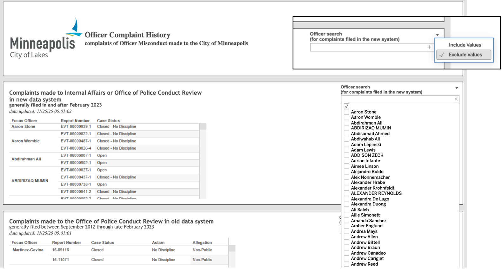
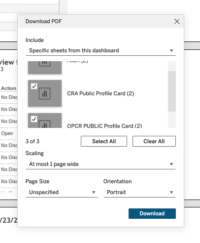
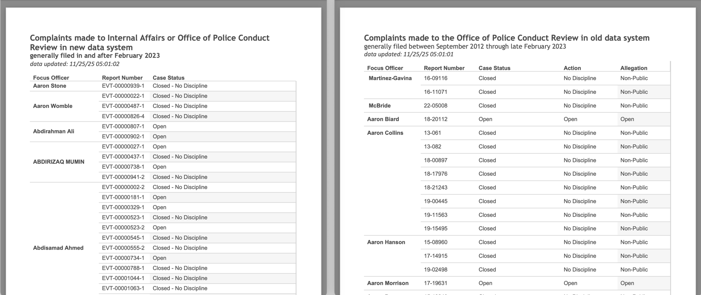
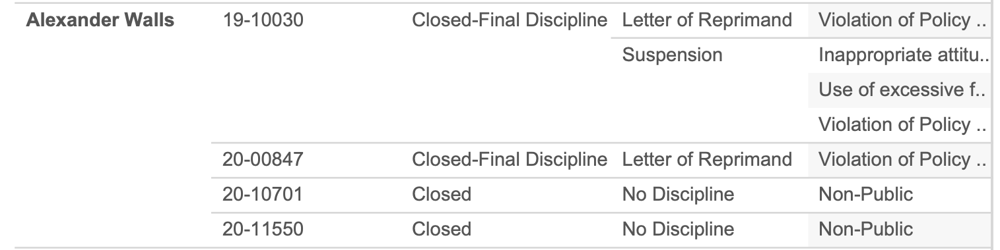
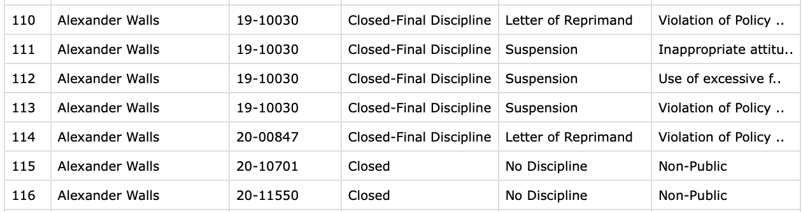

## Background

We hope our analysis of police complaint data in Minneapolis, Minnesota, will be helpful to community members, students, faculty members, MPD administrators, and other stakeholders. This technical appendix is meant to document our work so that it can be reproduced and to facilitate subsequent analyses being conducted in similar contexts. We provide additional documentation here for our processes for gathering and analyzing the data that were outside of the scope of the original post. We focus on a conceptual description in this document; the code for reading and organizing the original complaint data is available [here](https://github.com/dspace-qside/dspace-qside.github.io/tree/main/posts/complaint-network/complaint_scraping), the code for processing the data for network analysis is available [here](https://github.com/dspace-qside/dspace-qside.github.io/blob/main/posts/complaint-network/index.qmd), and the code for the Shiny app is available [here](https://github.com/dspace-qside/dspace-qside.github.io/tree/main/posts/complaint-network/complaint_network). <!-- These websites were linked in the Google doc but they aren't the right ones I don't think? -->

## Data Collection

### Data Source

The complaint data used in this analysis comes from the City of Minneapolis [Officer complaint history dashboard](https://www.minneapolismn.gov/government/government-data/datasource/officer-complaint-history-dashboard/). This page is a Tableau dashboard with three widgets, each displaying disjoint complaint data from a different time period and source. The Civilian Review Authority collected complaints filed before September 2012. The Office of Police Conduct Review (OCPR) was responsible for complaints from then through February 2023. Complaints from March 2023 onward are provided by Internal Affairs (IA) or the OCPR in an updated format. The latter two widgets, covering data from 2023-2025, were used in the network analysis, and their data collection and processing are described below.

### Downloading the Data

To extract data from this dashboard, we used Python scripts along with extensive manual selection. Unfortunately, none of the three widgets offered a direct data download option, so each widget required separate manual processing and customized scripts. Though the data are not easily exportable, the dashboard does allow printing the current view to PDF.[^1] Selecting the right combination of print options, explained below, creates a very long single-page PDF report with structured tables. Our task was then reduced to getting each dashboard to display all entries, exporting the views to PDF, and organizing the tables.

[^1]: It is important to note that the dashboard must be viewed in full-screen mode to see the download option.

For the two newest data sets, encompassing September 2012 to the present, this process was fairly straightforward. Above the officer search bar, there is a filter that allows the user to either Include Values or Exclude Values. By switching the filter to Exclude, typing a single space " ", and selecting the empty tick box, the dashboard conveniently returns all entries. This procedure is shown in @fig-select.

{#fig-select width="100%"}

After displaying all named officers in both dashboards, we exported the views to a single PDF using the specific settings shown in @fig-options.

{#fig-options width="40%"}

The resulting PDF contains two very long pages, one for each widget, each with a slightly different tabular format, as shown in @fig-pdfs.

{#fig-pdfs width="100%"}

### Data Cleaning

Finally, we used the [`PyPDF2`](https://pypi.org/project/PyPDF2/) Python package to read the PDF files and perform data cleaning. Because the PDF preserves actual text rather than an image rendering, all extracted text data matches the original content[^2]. However, there are some issues with the initial data tables. Row-wise, the output is incomplete. Ideally, each row would contain an officer name, report number, case status, action, and discipline, as available. Instead, each officer’s name appears only once and is implicitly repeated for subsequent rows until the next horizontal separator. A similar issue persists in other columns, where a single report number corresponds to multiple actions or allegations, as shown in the example in @fig-tricky. Therefore, we needed to clean the data to complete these tables.

[^2]: The accuracy of PDF text extraction can be a concern for certain data formats, especially when optical character recognition is used to extract text as a string data type.

::: {#fig-tricky layout-ncol="2"}

A particularly tricky data case with nested column values
:::

We used both text extraction and text location (i.e., where each entry appears on the page), as well as pattern matching (e.g., complaint numbers starting with "EVT-"), to reconstruct the correct ordering. Because the columns in the PDF are well separated, the horizontal position of each word chunk was sufficient to infer its column. Officer names were forward-filled until the next name appeared. This was repeated for all column types, including cases where multiple actions or allegations corresponded to one complaint. The final output is an organized Pandas dataframe for each dataset, with one row per complaint entry containing the officer, report number, and status.

### Data Verification

Data ordering was checked for correctness. String matching was used to ensure complaint numbers followed the prescribed digit pattern or began with the "EVT-" prefix. All unique values for Case Status, Action, and Allegation were printed to confirm no unexpected entries were present. For example, Case Status should only take the entries "Open", "Closed", or "Closed-Final Discipline". Unfortunately, many Allegation entries were truncated in both the PDF and the dashboard when the string length exceeded the column width, so some details may be missing from the data we collected. Some particularly tricky table entries, like the one shown in @fig-tricky, were also manually checked for accurate ordering and complete data capture.

## Preparation of the Data for Network Analysis

We constructed the network from two data sources: (1) web-scraped MPD complaint records from 2023-2025 as discussed above and (2) the official roster of active MPD officers from 2023-2025 obtained through a [public data request](https://minneapolis.service-now.com/opencityportal?id=clerks_index). Because the roster is updated annually, we used each officer’s most recent roster entry across these three years to represent their current position, yielding a one-row-per-officer roster table used to attach officer attributes to the co-complaint network nodes. In total, the combination of the 2023-2025 annual snapshot rosters includes 659 unique officers, and the complaint records contain 448 unique officer names.

### Node Construction from Roster

We used officer names to match the characteristics from the officer rosters to the complaint data, as badge numbers/IDs were not available in both datasets. These names occasionally differed across the two sources due to punctuation (e.g., hyphens or apostrophes), spacing, and minor spelling differences. Therefore, we implemented a standardized name-cleaning and validation process before merging the two datasets. We first constructed a consistent “first + last” name representation for each officer by trimming extraneous white space and retaining only the primary first name when additional tokens (e.g., middle names/initials) were present. We then applied identical normalization rules to both datasets - converting names to lowercase and removing common formatting variation such as hyphens and extra spaces - to reduce mismatches introduced through scraping or data entry. After standardization, we compared the sets of unique officer names across the roster and complaint records. Initially, 87.05% of the unique names in the complaint data matched a roster name. We then extracted the 58 unmatched names from the complaint data and used string-based record linkage to evaluate whether mismatches reflected correctable spelling/formatting differences or truly non-roster individuals (e.g., officers that were not present on these three annual roster snapshots). For each unmatched name, we identified the most plausible roster counterpart by computing the closest roster name under a string-similarity measure (i.e., the smallest edit distance) and ranking unmatched names by this minimum distance. Names with very small discrepancies were flagged for manual review as likely spelling or formatting issues, whereas names with larger discrepancies were treated as more likely to represent different individuals truly not present in the rosters and were left unchanged. Based on this ranked review, we manually corrected 14 high-confidence names using a documented list of manual changes. The matched names across the complaint and roster datasets are included in @tbl-names.

::: {.grid}

::: {.g-col-2}
:::

::: {.g-col-8}

| Name in Complaint Data | Name in Roster             |
|:-----------------------|:---------------------------|
| ariel lunasanchez      | ariel luna sanchez         |
| daniel oppergard       | daniel oppegard            |
| kelly o'rourke         | kelly orourke              |
| nicolas custode        | nicholas custode           |
| paul o'hanlon          | paul ohanlon               |
| timothy davis jr       | timothy davis jr.          |
| charlie adams          | charles adams              |
| scott aikins           | scott aikins i             |
| jeff werner            | jeffrey werner             |
| luke weatherspoon      | lucas weatherspoon         |
| craig crisp            | craig crisp jr.            |
| marjane khazraeinazm.. | marjane khazraeinazmpour   |
| richard walker         | richard walker sr.         |
| nicholas sciorrotta jr | nicholas sciorrotta jr jr. |

: Matched names between MPD roster and MPD complaint data. {#tbl-names .striped}
:::

::: {.g-col-2}
:::

:::

We also checked for name ambiguity within the roster data by identifying cases where the same standardized name corresponded to multiple distinct officer IDs. We want to ensure the merge of the roster and complaint data did not inadvertently combine complaints from different individuals with the same name. We found one instance in which two officers shared the exact same name but had different IDs. The complaint data contains the IDs for these two officers (and these two officers alone) to differentiate them, so to prevent mis-linkage for the officers who share this name, we also appended the ID as a suffix to their name in the roster data.

After these corrections, 90.63% of the unique names in the complaint records matched a roster name (406 matched officers), indicating that 61.6% of the 659 rostered officers had at least one documented complaint during 2023–2025. We then counted the number of complaints associated with each officer and attached this count to the co-complaint network nodes, discussed next, as an officer-level attribute for visualization.

### Edge Construction from Complaints

Finally, to construct the edge list for the co-complaint network, we used a dataset that contained complaint data at the individual officer level, so that each row represented an individual officer present in an individual complaint. To build the co-complaint edge list, we iterated over all unique complaint IDs in this final dataset. For each complaint ID, we identified the set of involved officers and generated all unique unordered officer pairs; each pair represents a co-complaint tie, indicating joint involvement in the same complaint. Nodes in the network were defined as the unique officers appearing in the final co-complaint data, filtered to only contain officers that were in our rosters. For network visualization purposes, we created a dataset with node attributes, such as number of complaints and officer rank from the roster data as well as network statistics like betweenness centrality. Finally, duplicate officer pairs were collapsed so that each officer-to-officer connection appears only once in the final undirected, unweighted network, regardless of how many times a pair was named in the same complaint. The edge list and node attributes were then used to create a set of interactive visualizations using Shiny.
